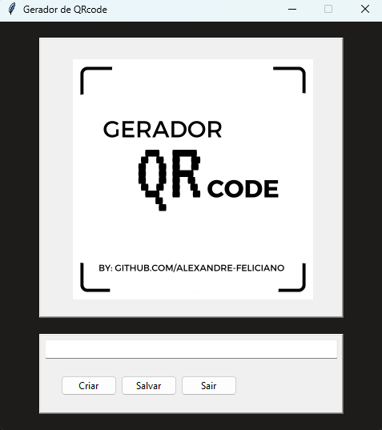
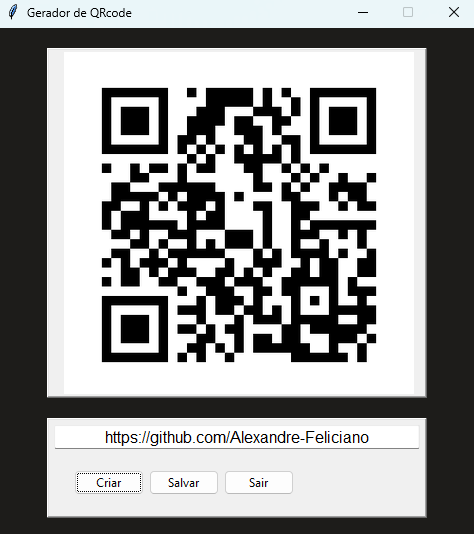

# 📌 Gerador-de-QRcode

## Introdução

Esse é um App gerador de QRcode que foi feito com o intuito na aprendizagem da biblioteca Tkinter.

---

## Biblioteca Tkinter

- Tkinter é uma biblioteca da linguagem Python que acompanha a instalação padrão e permite desenvolver interfaces gráficas. Isso significa que qualquer computador que tenha o interpretador Python instalado é capaz de criar interfaces gráficas usando o Tkinter, com exceção de algumas distribuições Linux, exigindo que seja feita o download do módulo separadamente.

---

## ⌨ Tecnologias utilizadas

[Python](https://www.python.org);
[Biblioteca Tkinter.](https://docs.python.org/pt-br/3.13/library/tk.html);
[Biblioteca qrcode.](https://pypi.org/project/qrcode/).

---

## 🚀Funcionalidades 

✅ Gerar QR Codes instantaneamente.  
✅ Interface gráfica amigável com **Tkinter**.  
✅ Salvar QR Codes gerados como imagem.  
✅ Aplicação leve e fácil de usar.

---

## 🖥️ Como Criar um Executável (.exe)

Se quiser rodar o programa sem precisar instalar Python, siga os passos abaixo para gerar um `.exe` com **PyInstaller**.

### 🔹 1. Instale o PyInstaller

```sh
pip install pyinstaller
```

### 🔹 2. Gere o Executável

```sh
pyinstaller --onefile --windowed --name "Gerador_QRCode" main.py
```

📌 O executável será criado na pasta `dist/`, e estará pronto para ser distribuído.

---

## 🖼️ Imagens





---

## 📜 Licença

Este projeto está sob a licença **MIT**. Sinta-se à vontade para usá-lo e modificá-lo conforme necessário. 😊